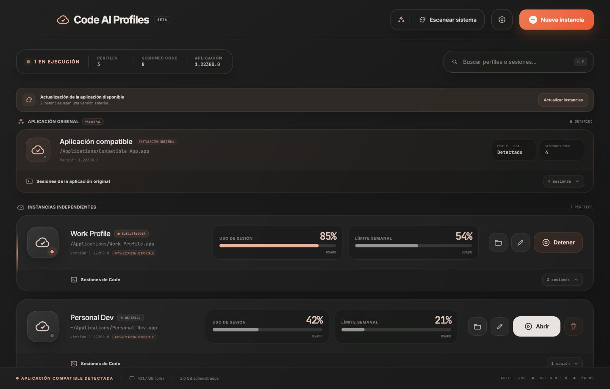
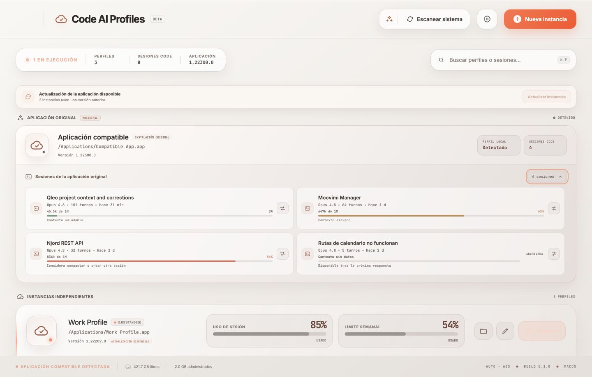

# Code AI Profiles

[](https://github.com/braiyan-chundo/code-ai-profiles/actions/workflows/validate.yml)
[](https://github.com/braiyan-chundo/code-ai-profiles/actions/workflows/build-desktop.yml)
[](LICENSE)

Aplicación de escritorio open source creada con Tauri, React y Rust para administrar perfiles aislados de una aplicación de IA compatible. Cada perfil mantiene sus propios datos, puede ejecutarse al mismo tiempo que los demás y ofrece una vista unificada de uso, sesiones y contexto.

> Estado: beta técnica. No uses perfiles ni sesiones irremplazables sin conservar un respaldo.





## Funciones principales

- Detecta automáticamente la aplicación compatible instalada.
- Crea perfiles independientes y los inicia de forma simultánea.
- Muestra el estado ejecutándose/detenido, la versión y el uso de sesión y semanal disponible.
- Escanea automáticamente cada 60 segundos y permite un escaneo manual con progreso visible.
- Alerta cuando una copia administrada necesita actualizarse desde la aplicación original.
- Incluye la instalación original en el mismo dashboard que las instancias administradas.
- Lista sesiones locales con título, modelo, turnos, actividad, estado archivado y contexto estimado.
- Permite desplegar o contraer las sesiones de cada perfil.
- Permite copiar, mover, devolver y desvincular sesiones entre perfiles detenidos.
- Incluye temas claro, oscuro y del sistema, además de tres tamaños de texto para las sesiones.
- Usa controles de ventana apropiados para macOS y decoraciones compatibles en Windows y Linux.

## Plataformas

| Plataforma | Arquitectura | Paquetes | Estado |
| --- | --- | --- | --- |
| macOS | Apple Silicon | `.app`, `.dmg` | Compatible |
| Windows | x64 | `.msi`, `.exe` NSIS | Compatible |
| Linux | x64 y ARM64 | `.deb`, `.AppImage` | Compatible |

Los instaladores de cada plataforma se compilan en runners nativos mediante [`.github/workflows/build-desktop.yml`](.github/workflows/build-desktop.yml). Los paquetes generados aún no están firmados ni notarizados.

## Desarrollo local

Requisitos comunes:

- Node.js 24 y npm.
- Rust estable mediante `rustup`.
- Las dependencias de sistema de Tauri 2 para la plataforma.

Instala dependencias y abre el modo de desarrollo:

```bash
npm ci
npm run tauri -- dev
```

Verifica el frontend y las pruebas de Rust:

```bash
npm run build
cargo test --manifest-path src-tauri/Cargo.toml
```

## Desarrollo asistido por IA y Graphify

El repositorio incluye cuatro agentes de desarrollo: `architect`, `backend`, `frontend` y `document`. Sus instrucciones neutrales viven en [`.agents/roles/`](.agents/roles/README.md) y Codex dispone de adaptadores con modelos independientes en [`.codex/agents/`](.codex/agents/). Toda feature o fix requiere una HU única en [`docs/hu/`](docs/hu/index.md).

Graphify mantiene un grafo local del código que debe consultarse antes del análisis y actualizarse al cerrar cada iteración. Instala la versión fijada por el proyecto y genera o actualiza sus artefactos:

```bash
uv tool install graphifyy==0.9.32
npm run graph:update
```

Antes de enviar cambios, comprueba que el grafo versionado coincide con el código:

```bash
npm run graph:check
```

El grafo se extrae localmente mediante AST y no requiere claves ni envía el código a un modelo externo. Consulta [la documentación del flujo de agentes](docs/agents.document.md) y [la integración de Graphify](docs/graphify.document.md).

## Crear cada versión

Tauri recomienda compilar cada paquete en el sistema operativo de destino. El workflow de GitHub Actions contiene la matriz reproducible para las cuatro variantes publicadas.

### macOS Apple Silicon

Instala las herramientas de Xcode:

```bash
xcode-select --install
```

Compila la aplicación y el DMG:

```bash
npm ci
npm run build:macos
```

Resultados:

```text
src-tauri/target/release/bundle/macos/Code AI Profiles.app
src-tauri/target/release/bundle/dmg/*.dmg
```

### Windows x64

Instala Microsoft C++ Build Tools con la carga de trabajo «Desktop development with C++», WebView2 y Rust para el target MSVC. Después ejecuta en PowerShell:

```powershell
npm ci
npm run build:windows
```

Resultados:

```text
src-tauri\target\release\bundle\msi\*.msi
src-tauri\target\release\bundle\nsis\*.exe
```

### Linux x64 o ARM64

En Ubuntu/Debian instala las dependencias usadas por el CI:

```bash
sudo apt-get update
sudo apt-get install -y libwebkit2gtk-4.1-dev libappindicator3-dev librsvg2-dev patchelf
```

Compila el paquete DEB y el AppImage en una máquina de la arquitectura objetivo:

```bash
npm ci
npm run build:linux
```

Resultados:

```text
src-tauri/target/release/bundle/deb/*.deb
src-tauri/target/release/bundle/appimage/*.AppImage
```

Para obtener todas las variantes desde GitHub, ejecuta manualmente el workflow **Build desktop installers** y descarga sus artifacts.

## Cómo funciona el aislamiento

Los perfiles administrados se guardan bajo el directorio de datos de Code AI Profiles:

```text
Code AI Profiles/
└── instances/
    └── <id>/
        ├── application/   copia o lanzador administrado
        └── profile/       datos independientes de la instancia
```

- En macOS se intenta usar clone-on-write de APFS y se conserva un bundle con el nombre del perfil para que Finder y el Dock lo identifiquen.
- En Windows se copia el directorio de la aplicación y cada proceso recibe su propio directorio de datos.
- En Linux se crea un lanzador hacia el binario instalado para conservar su sandbox y permitir que el gestor de paquetes actualice el ejecutable compartido.

Cuando la aplicación original cambia de versión, macOS y Windows pueden reemplazar únicamente la copia administrada sin tocar el perfil. En Linux, las instancias siguen el binario actualizado por el gestor de paquetes.

## Sesiones y contexto

El dashboard deserializa solamente una lista permitida de metadatos visuales. Para estimar el contexto, lee el uso de la respuesta principal más reciente y suma los tokens de entrada, creación de caché y lectura de caché; no carga ni muestra prompts, respuestas, razonamientos ni resultados de herramientas.

Los umbrales son recomendaciones del proyecto:

- Menos de 60%: contexto saludable.
- Desde 60%: contexto elevado.
- Desde 80%: conviene compactar o iniciar una sesión nueva.

Después de una compactación, el valor se oculta hasta que exista una respuesta nueva. Estas señales ayudan a tomar decisiones, pero no representan límites oficiales del proveedor.

Las operaciones de sesión requieren que el origen y el destino estén detenidos:

- **Copiar** mantiene la sesión vinculada en el origen y el destino.
- **Mover** retira el índice del origen y conserva la relación para devolverla.
- **Devolver** restablece una sesión movida en su perfil de procedencia.
- **Desvincular** quita una copia del perfil secundario sin borrar su origen.

Las transferencias son experimentales. Conserva un respaldo y no abras simultáneamente una misma sesión copiada desde dos perfiles.

## Privacidad y seguridad

Code AI Profiles no descifra, copia ni muestra credenciales, cookies o tokens OAuth. El escaneo trabaja con archivos locales ya disponibles para el usuario y falla de forma segura si un formato deja de ser compatible.

No incluyas datos reales de cuentas, perfiles, transcripts o credenciales en issues, pull requests o capturas públicas.

## Compatibilidad actual y marcas

La primera integración compatible es Claude Desktop y sus sesiones locales de Claude Code. La detección depende de nombres de ejecutables, rutas y formatos locales de estos productos, por lo que algunas referencias técnicas se conservan únicamente dentro de la capa de integración.

Code AI Profiles es un proyecto independiente: no está afiliado, respaldado ni aprobado por Anthropic. Claude, Claude Desktop y Claude Code son marcas de sus respectivos titulares. La arquitectura y la marca del proyecto son neutrales para permitir soporte futuro de otras aplicaciones, pero ninguna integración adicional se anuncia todavía.

Para no perder los datos de instalaciones anteriores, el identificador interno heredado `com.braiyan.claudeprofiles` se mantiene de forma intencional. No es el nombre público del producto.

## Contribuir

La rama predeterminada es `develop`. Antes de programar:

1. Abre un issue con tu propuesta.
2. Espera autorización explícita de `@braiyan-chundo`.
3. Envía el pull request exclusivamente hacia `develop`.

`main` contiene publicaciones estables y solo el mantenedor puede actualizarla mediante un pull request desde `develop`. Los PR externos hacia `main` se cierran automáticamente. Consulta [CONTRIBUTING.md](CONTRIBUTING.md) para conocer el proceso completo.

## Licencia

Distribuido bajo [Apache License 2.0](LICENSE). Esta licencia permite uso, modificación y distribución, incluye una concesión expresa de patentes y exige conservar los avisos aplicables.
